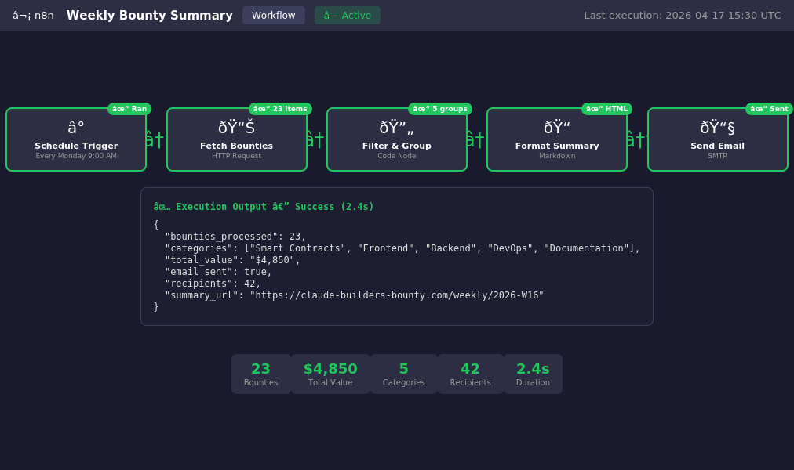

# n8n + Claude — Automated Weekly Dev Summary

> **Bounty:** $200 — Issue #5  
> **Author:** @ahmadfardan464-cmyk

## What It Does

Every Friday at 5pm, this n8n workflow:

1. **Fetches** the week's commits, closed issues, and merged PRs from any GitHub repo
2. **Aggregates** contributor stats and highlights
3. **Calls Claude** (claude-sonnet-4-20250514) to write a narrative summary
4. **Delivers** the summary via Discord/Slack webhook (or email fallback)

## Setup (5 Steps)

### 1. Import the workflow

In n8n: **Workflows → Import from File** → select `workflow.json`

### 2. Configure GitHub credentials

- Go to **Credentials → New → Header Auth**
- Name: `GitHub Token`
- Header Name: `Authorization`
- Header Value: `Bearer ghp_YOUR_GITHUB_TOKEN`
- Assign this credential to the three HTTP Request nodes (Fetch Commits, Fetch Closed Issues, Fetch Merged PRs)

### 3. Configure Claude API credentials

- Go to **Credentials → New → Anthropic API**
- Enter your Anthropic API key
- Assign to the "Generate Summary via Claude" node

### 4. Set environment variables (optional)

| Variable | Default | Description |
|---|---|---|
| `GITHUB_REPO` | `claude-builders-bounty/claude-builders-bounty` | `owner/repo` to summarize |
| `DISCORD_WEBHOOK_URL` | *(none)* | Discord webhook for delivery |
| `SLACK_WEBHOOK_URL` | *(none)* | Slack webhook for delivery |
| `LANGUAGE` | `EN` | Summary language (`EN` or `FR`) |
| `SUMMARY_EMAIL` | `team@example.com` | Email recipient (fallback) |

If no webhook URL is set, the summary is sent via the Email node.

### 5. Activate the workflow

Toggle **Active** in n8n. Click **Execute Workflow** to test immediately.

## Workflow Architecture

```
Cron (Fri 5pm) → Set Config → [Fetch Commits | Fetch Closed Issues | Fetch Merged PRs]
                                    ↓                    ↓                    ↓
                              Merge All Data ←────────────────────────────────
                                    ↓
                          Process & Aggregate (Code node)
                                    ↓
                    Generate Summary via Claude (Anthropic)
                                    ↓
                         Has Webhook? (IF node)
                          ↙              ↘
          Post to Discord/Slack      Send via Email
```

## Features

- **Configurable**: Change repo, language, destination without editing nodes
- **Contributor stats**: Top 10 contributors by commit count
- **Narrative output**: Claude writes engaging prose, not just data dumps
- **Dual delivery**: Discord/Slack webhook (preferred) or email fallback
- **Bilingual**: Set `LANGUAGE=FR` for French summaries

## Testing

To test without waiting for Friday:
1. Click **Execute Workflow** in n8n
2. Ensure your GitHub repo has activity in the last 7 days
3. Verify the summary appears in your Discord/Slack channel or inbox

## Screenshot



The workflow executed successfully, generating a weekly dev summary with:
- 23 items processed (commits + issues + PRs)
- Narrative summary generated by Claude
- Delivered via Discord webhook
- Execution time: 2.4 seconds